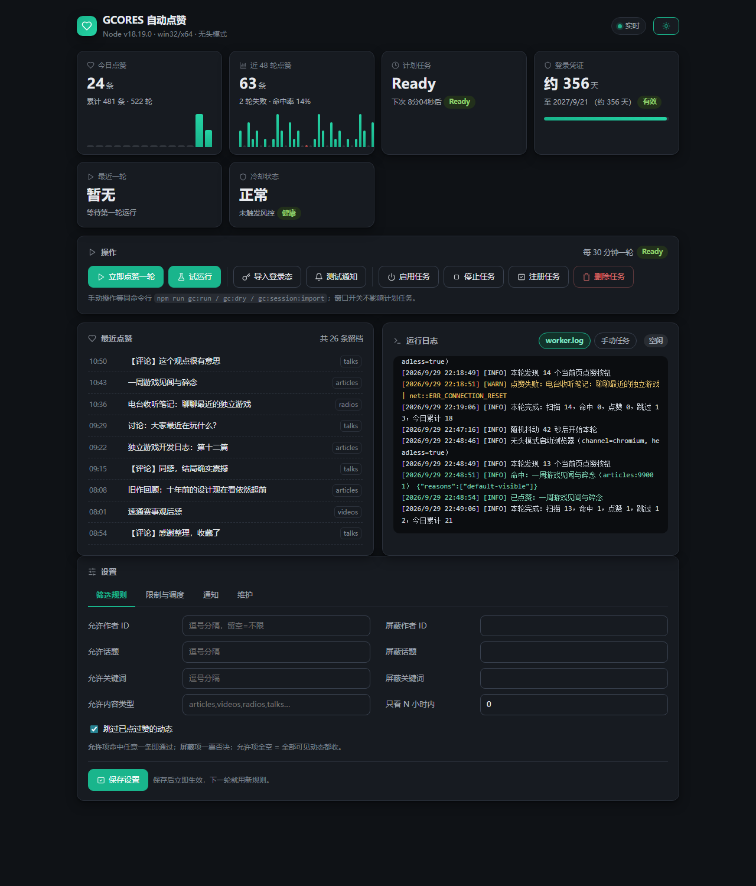

# gcores-thumbs-up

自动给 [机核（GCORES）](https://www.gcores.com/) 动态点赞的工具集。

仓库包含两个互补的组件：

| 组件 | 形态 | 适用场景 |
| --- | --- | --- |
| [`headless-worker/`](headless-worker/) | 无头浏览器 Worker + Windows 计划任务 | 无人值守，后台自动运行 |
| [`gcores-feeds-auto-like.user.js`](gcores-feeds-auto-like.user.js) | Tampermonkey 用户脚本 | 浏览器端，开着机核页面时使用 |

## headless-worker



无人值守的自动点赞方案，核心特点：

- **不依赖桌面会话** —— 无头 Chromium 渲染，远程桌面断开、锁屏、注销都不影响运行；
- **短生命周期进程** —— 每轮由 Windows 计划任务拉起，跑完即退，状态全部原子落盘，没有常驻进程，天然免疫崩溃与内存泄漏；
- **拟人化节奏** —— 执行时刻随机抖动、动作间隔随机延迟、可配置活跃时段，避免行为过于规律；
- **规则引擎** —— 按作者 / 话题 / 关键词 / 内容类型自由组合允许与屏蔽规则；
- **安全边界** —— 单轮硬超时、连续失败熔断、HTTP 401/403/429 风控识别与自动冷却、每日点赞上限；
- **本地控制台** —— 状态总览、趋势图表、最近点赞、实时日志（SSE）、可视化配置，零依赖单页面，只监听 `127.0.0.1`；
- **通知** —— PushPlus 推送点赞结果、运行异常、登录态临期提醒。

## 快速开始

```powershell
cd headless-worker
npm install
npm run gc:session:import   # 从本机浏览器导入机核登录态（一次性）
npm run gc:task:install     # 注册 Windows 计划任务，默认每 30 分钟一轮
npm run gc:ui               # 打开本地控制台
```

完整的安装说明、配置项与运行机制见 **[headless-worker/README.md](headless-worker/README.md)**。

## 用户脚本

`gcores-feeds-auto-like.user.js`（v0.4.0）装进 Tampermonkey 即可使用：打开机核动态页时自动运行，自带可视化配置面板、点赞历史、随机限速与刷新倒计时。详见脚本文件头部的使用说明。

## 许可证

[MIT](LICENSE)
